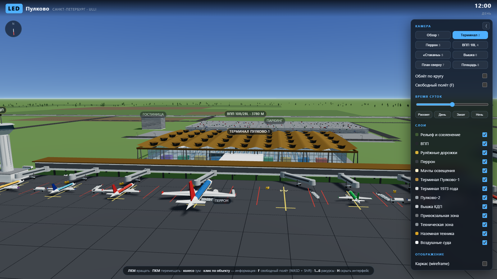
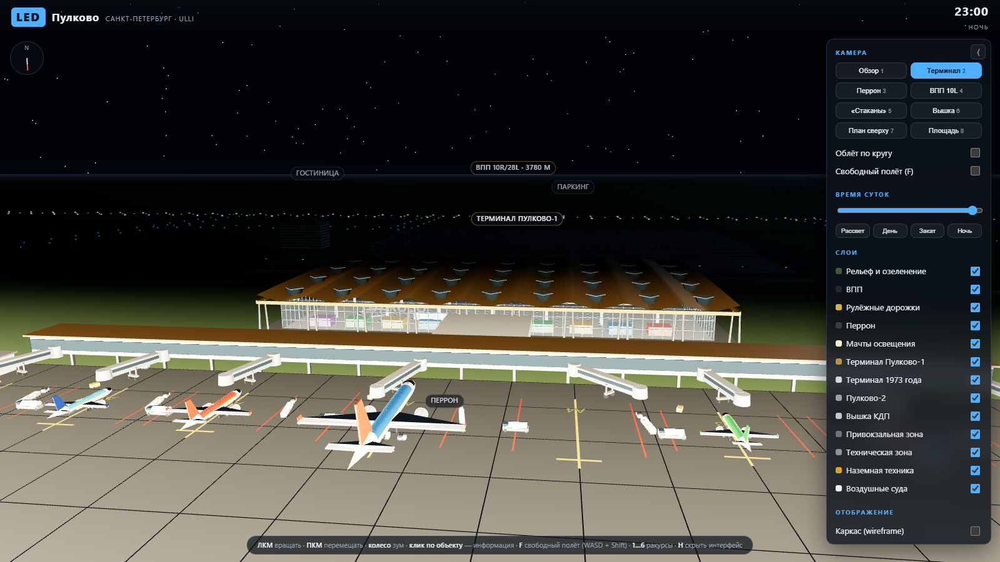
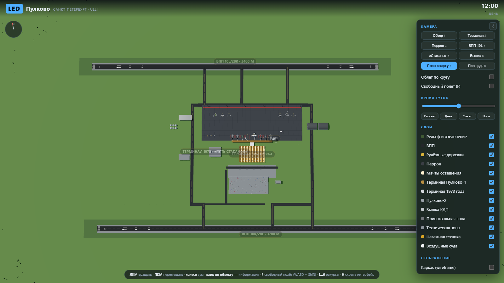

# Пулково 3D

Интерактивная трёхмерная модель аэропорта **Пулково** (LED / ULLI, Санкт-Петербург) в браузере.
Вся геометрия строится процедурно из кода — внешних 3D-моделей нет, вес сборки ~600 КБ.

## Демо

Живая версия: **https://arharovetc.github.io/pulkovo-3d/**

Демо публикуется из ветки `gh-pages`. Обновить:

```bash
VITE_BASE=/pulkovo-3d/ npm run build
# затем содержимое dist/ выкладывается в ветку gh-pages
```



## Что внутри

**Лётное поле**
- две ВПП — 10L/28R (3400 м) и 10R/28L (3780 м) с полной разметкой: осевая, зебра порога, прицельные точки, зоны приземления, номера курсов;
- сеть рулёжных дорожек с жёлтой осевой и синими боковыми огнями;
- перрон: 8 контактных стоянок и 6 удалённых, разметка осей заруливания и габаритов;
- светосигнальное оборудование: кромочные и осевые огни ВПП, зелёные пороговые, красные концевые, огни приближения.

**Здания**
- **Терминал Пулково-1** (2013) — складчатая золотистая кровля с квадратными световыми воронками, сплошное остекление, галерея выходов с 8 телескопическими трапами, проработанный интерьер (стойки регистрации, багажные карусели, торговая галерея, табло, зона ожидания);
- **исторический терминал 1973 года** — те самые «пять стаканов» А. В. Жука;
- **Пулково-2**, диспетчерская вышка с вращающимся радаром, ангары ТО, склад ГСМ, грузовой терминал;
- привокзальная зона: многоуровневый паркинг, гостиница, дороги, остановки, освещение.

**Движение**
- воздушные суда пяти типов (SSJ100, A320neo, B737-800, A330-300, B777-300ER) в восьми ливреях;
- сценарии: руление на исполнительный старт, взлёт с набором высоты, заход по глиссаде с посадкой и пробегом;
- наземная техника: перронные автобусы, багажные поезда, топливозаправщики, буксировщики, деайсеры, трапы;
- проблесковые маяки, аэронавигационные огни.

## Управление

| Действие | Как |
| --- | --- |
| Вращать камеру | ЛКМ + перемещение |
| Панорамировать | ПКМ + перемещение |
| Зум | Колесо мыши |
| Информация об объекте | Клик по объекту |
| Готовые ракурсы | Клавиши `1`…`8` |
| Свободный полёт | `F`, затем `WASD`, `Q`/`E` — вниз/вверх, `Shift` — ускорение |
| Скрыть интерфейс | `H` |
| Снять выделение | `Esc` |

В боковой панели: выбор ракурса, автоматический облёт по кругу, ползунок времени суток (полный суточный цикл со сменой неба, теней и включением огней), включение и отключение слоёв, каркасный режим, тени, подписи, **разрез терминала** (скрывает кровлю и фасады, открывая интерьер) и скорость анимации.



## Запуск

```bash
npm install
npm run dev      # разработка, http://localhost:5173
npm run build    # production-сборка в dist/
npm run preview  # просмотр собранной версии
```

Нужен Node.js 20+.

## Стек

- [Three.js](https://threejs.org/) — рендеринг (WebGL2, ACES-тонмаппинг, PCF-тени);
- [Vite](https://vitejs.dev/) — сборка и dev-сервер;
- никаких других зависимостей.

## Структура

```
src/
  main.js                — сборка сцены, интерфейс, цикл рендеринга
  scene/
    layout.js            — генеральный план: координаты ВПП, перрона, зданий
    environment.js       — небо (собственный шейдер), солнце, суточный цикл
    airfield.js          — земля, ВПП, РД, перрон, огни, мачты освещения
    terminal.js          — Пулково-1: кровля, фасады, интерьер, телетрапы
    buildings.js         — «пять стаканов», Пулково-2, КДП, привокзальная и техническая зоны
    aircraft.js          — параметрическая модель самолёта, типы и ливреи
    vehicles.js          — наземная спецтехника
    traffic.js           — движение по кривым: руление, взлёт, посадка, техника
  systems/
    cameraModes.js       — ракурсы, орбитальная камера, режим свободного полёта
    picking.js           — выбор объектов и карточки с описанием
    labels.js            — HTML-подписи, привязанные к точкам сцены
  utils/
    materials.js         — реестр материалов, ночной режим, wireframe
    helpers.js           — примитивы, детерминированный ГПСЧ, текстуры
```

Единица измерения сцены — **1 метр**. Локальная ось `+X` направлена по курсу 100°, вся группа аэропорта повёрнута так, чтобы ВПП совпадали с реальными магнитными курсами.



## Точность модели

Планировка воспроизводит схему аэропорта в обобщённом виде: длины и курсы ВПП, взаимное расположение полос и терминалов, узнаваемую архитектуру Пулково-1 и здания 1973 года. Это визуализация, а не аэронавигационный документ — для реальной навигации используйте официальные схемы AIP.

## Лицензия

MIT
