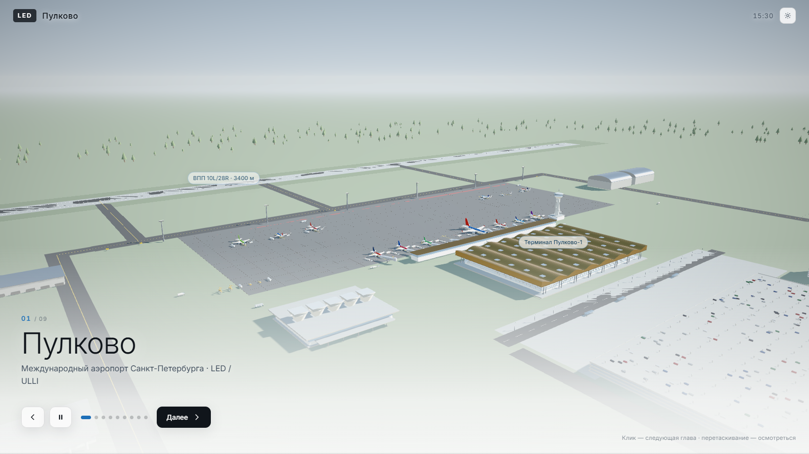
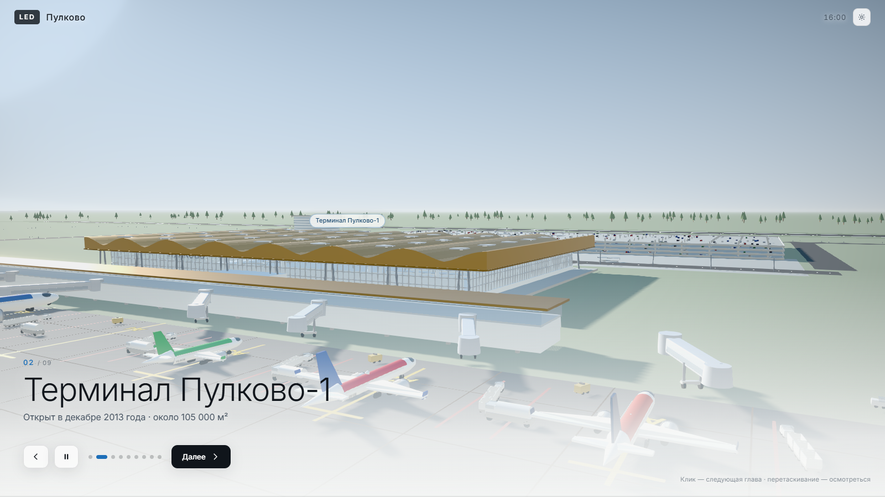
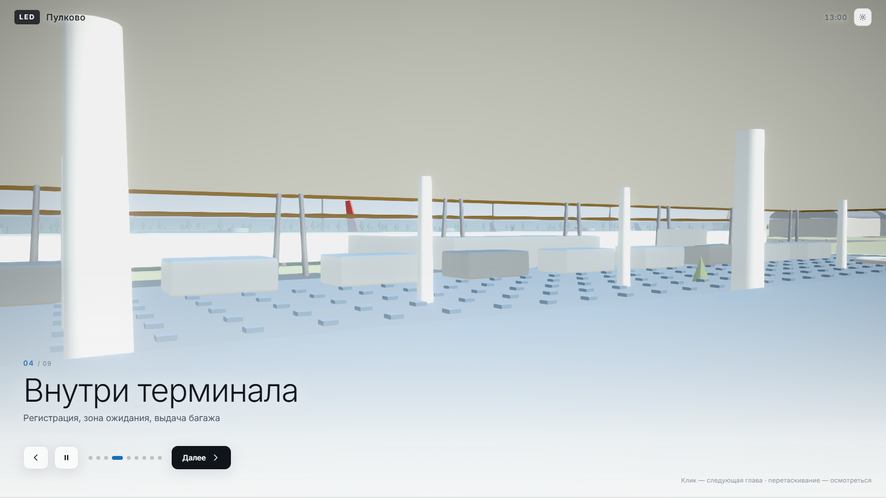
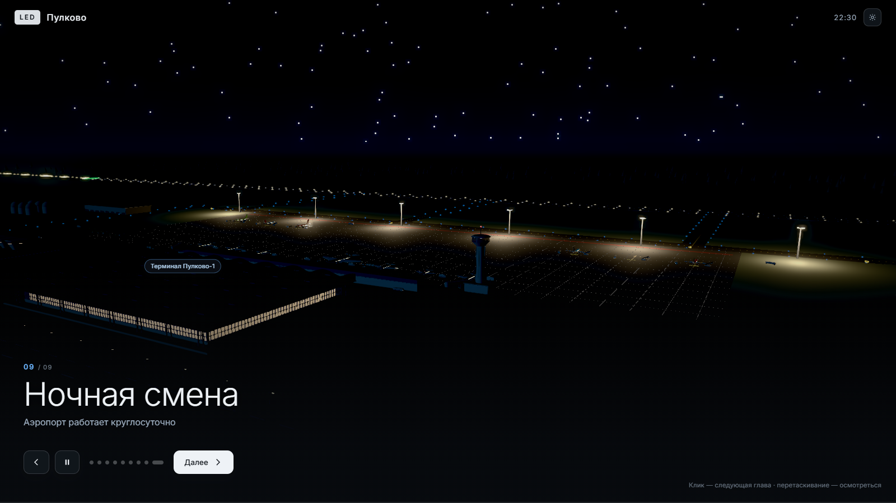

# Пулково 3D

Интерактивная трёхмерная модель аэропорта **Пулково** (LED / ULLI, Санкт-Петербург),
собранная как готовая презентация: открыл ссылку, нажал «Далее» — камера сама летит по кадру,
сверху идёт титр главы. Вся геометрия строится процедурно из кода, внешних 3D-моделей нет.

## Демо

**https://arharovetc.github.io/pulkovo-3d/**



## Как показывать

Показ разбит на **девять глав**. В каждой камера медленно идёт по своей траектории и смотрит
в свою точку — картинка живёт сама, пока вы говорите.

| Действие | Как |
| --- | --- |
| Следующая глава | Клик по сцене, кнопка **Далее**, `→` или `пробел` |
| Предыдущая | `←` |
| Конкретная глава | Клавиши `1`…`9` или точки внизу |
| Остановить движение камеры | `P` или кнопка паузы |
| Осмотреться вручную | Перетаскивание мышью, колесо — зум (через несколько секунд камера сама вернётся в кадр) |
| Скрыть весь интерфейс | `H` — для чистого скриншота |
| Панель инструментов | `T` — время суток, слои, разрез, каркас |

Главы: общий вид · терминал Пулково-1 · складчатая кровля · внутри терминала ·
перрон · «пять стаканов» · лётное поле · генеральный план · ночная смена.



## Что в модели

**Лётное поле**
- две ВПП — 10L/28R (3400 м) и 10R/28L (3780 м) с полной разметкой: осевая, зебра порога,
  прицельные точки, зоны приземления, номера курсов;
- сеть рулёжных дорожек с жёлтой осевой и синими боковыми огнями;
- перрон: 8 контактных стоянок и 6 удалённых, разметка осей заруливания;
- светосигнальное оборудование: кромочные и осевые огни ВПП, зелёные пороговые,
  красные концевые, огни приближения, прожекторные мачты перрона.

**Здания**
- **Терминал Пулково-1** (2013): объёмная складчатая кровля с квадратными световыми фонарями,
  сплошное остекление с частой сеткой импостов, галерея выходов с 8 телетрапами,
  проработанный интерьер — стойки регистрации, багажные карусели, зона ожидания, торговая галерея;
- **исторический терминал 1973 года** — «пять стаканов» А. В. Жука;
- Пулково-2, диспетчерская вышка с вращающимся радаром, ангары ТО, склад ГСМ, грузовой терминал;
- привокзальная зона: многоуровневый паркинг, гостиница, дороги, остановки, освещение.

**Движение**
- воздушные суда пяти типов (SSJ100, A320neo, B737-800, A330-300, B777-300ER) в восьми ливреях;
- сценарии: руление на исполнительный старт, взлёт с набором высоты, заход по глиссаде и посадка;
- наземная техника: автобусы, багажные поезда, топливозаправщики, буксировщики, деайсеры, трапы.



## Как это отрисовано

- **Освещение:** физически корректное солнце с суточным циклом (азимут и высота считаются от часа),
  небо — собственный шейдер, из него же генерируется PMREM-карта окружения,
  поэтому стекло и металл дают правдоподобные отражения.
- **Постобработка:** GTAO (мягкое затенение в стыках), сдержанный bloom, SMAA,
  тональная коррекция с виньеткой.
- **Тени:** карта 4096², мягкий PCF.
- **Адаптивное качество:** если видеокарта не тянет, тяжёлые эффекты отключаются автоматически —
  показ на чужом ноутбуке не превратится в слайд-шоу.
- Геометрия скруглена по рёбрам: фаска ловит блик, и объёмы читаются как макет, а не как кубы.



## Запуск

```bash
npm install
npm run dev      # http://localhost:5173
npm run build    # production-сборка в dist/
npm run preview
```

Нужен Node.js 20+.

## Структура

```
src/
  main.js                — сборка сцены, интерфейс, цикл рендеринга
  scene/
    layout.js            — генеральный план: координаты ВПП, перрона, зданий
    environment.js       — небо, солнце, суточный цикл, карта окружения
    airfield.js          — земля, ВПП, РД, перрон, огни, мачты освещения
    terminal.js          — Пулково-1: кровля, фасады, интерьер, телетрапы
    buildings.js         — «пять стаканов», Пулково-2, КДП, привокзальная и техническая зоны
    aircraft.js          — параметрическая модель самолёта, типы и ливреи
    vehicles.js          — наземная спецтехника
    traffic.js           — движение по кривым: руление, взлёт, посадка, техника
  systems/
    presentation.js      — главы показа и траектории камеры
    postfx.js            — постобработка
    labels.js            — подписи, привязанные к точкам сцены
  utils/
    materials.js         — палитра, ночной режим, wireframe
    helpers.js           — примитивы, детерминированный ГПСЧ, текстуры
```

Единица сцены — **1 метр**. Локальная ось `+X` направлена по курсу 100°, вся группа аэропорта
повёрнута так, чтобы ВПП совпадали с реальными магнитными курсами.

## Точность

Планировка воспроизводит схему аэропорта в обобщённом виде: длины и курсы ВПП, взаимное
расположение полос и терминалов, узнаваемую архитектуру Пулково-1 и здания 1973 года.
Это визуализация, а не аэронавигационный документ.

## Обновление демо

```bash
VITE_BASE=/pulkovo-3d/ npm run build
# содержимое dist/ выкладывается в ветку gh-pages
```

## Стек

[Three.js](https://threejs.org/) + [Vite](https://vitejs.dev/), других зависимостей нет.

## Лицензия

MIT
